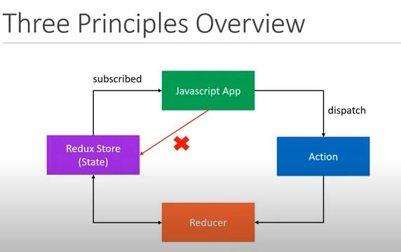

# Cake Shop

a Demo built by Redux toolkit 


## 2 - Core Concepts :
### Entities : 
 - shop : store case in a shelf
 - shopkeeper: behind the counter
 - customer: at the store entrance

### Activities : 
- Customer:  Order a cake
- Shop keeper:  - Box cake from a shelf
                - Receipt to keep track 

### ITEMS: 
- Shop : Store [hold the state of your application]
- Cake Ordered : Action [ Describe what happened in the application]
- Shop Keeper: Reducer [handle actions and decide how to update the state]


## 3- Three principles :

### 1- The Global state is stored as an object inside a single store. 

- Cake Shop [Tracking number of cake on the shelf]

```js
{
    numberOfCakes: 10
}
```
  
### 2- The Only way to change the state is to dispatch an action, an object that describes what happened. 

- Cake Shop  [Scan QR Code and Place an order] -- Action [CAKE_ORDERED]
  ```js
  {
    type : 'CAKE_ORDERED'
  }
  ```

 ### 3- To Specify how the state tree is updated based on actions, you write pure reducers
 Reducer - (previousState, action) ==> newState

- Cake Shop  - Reducer is the ShopKeeper
 
```js
 const reducer = (state = initalState , action) =>{
   switch(action.type){
    case CAKE_ORDERED: 
    return {
        numberOfCakes : state.numberOfCakes -1
    }
   }
 }
  ```

### Redux Workflow: 


  


## 4- Actions
 - only way to interact with store
 - carry some information from your app to the redux store
 - plain javascript objects
 - Have a `type` property that describes something that happened in the application.
 - The `type` is typically defined as string constants 
 - should use ActionCreator --> Function that returns the action in redux.

  ```js
  const CAKE_ORDERED  = 'CAKE_ORDERED';

  function orderCake(){ // action creator
    return {
      type: CAKE_ORDERED,
      quantity: 1
    }
  } 
  ``` 

## 5- Reducers

- Specify how the app's state changes in response to action sent to the store. 
- Function that accepts state and action as arguments and returns the next state of the application.

 ```js 
(previousState, action) ==> newState
```

```js
const initalState = {
    numOfCakes: 10,
}

const reducer = (state = initalState, action) => {
    switch (action.type) {
        case CAKE_ORDERED:
            return {
                ...state,
                numOfCakes: state.numOfCakes - 1,
            }
            break;

        default:
            return state
            break;
    }
}
```

## 6- Redux Store
One store for the entire application

### Responsibilities: 
- Holds Application state
- Allows Access to State via  `getState()`
- Allows state to be updated via `dispatch(action)`
- Registers listeners via `subscribe(listener)`
- Handles unregistering of listeneres via the function retuned by `subscribe(listener)`


**Note:** 
`createStore` : is depreacted & we can call `legacy_createStore` instead.

It is getting imported. It is just deprecated. It can still be imported in the future with legacy_createStore. They recommend to use redux-toolkit.


## 7- App main Scienarios:

**Cake Shop**
- ordering cake
- Restocking Cake
  
**Ice Cream**
- sell ice cream.
- ice cream stored in the freezer.
- new shopkeeper to handle ice cream ordered from customer.  
  
**State of the Shop**
- number of cakes in the shelf & number of ice-creams in the freezer. 
- seperate shopkeeper will help with scalability 

  ## 8 - Add Immer 
  `npm i immer`     
----------------------------
### Course Resource :
[Redux tutorial ](https://www.youtube.com/watch?v=0awA5Uw6SJE&list=PLC3y8-rFHvwiaOAuTtVXittwybYIorRB3&index=2)
